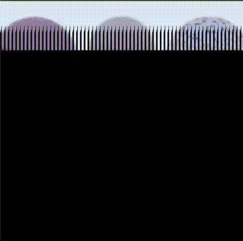

After the extraction is complete, there is a folder named "frame" in the folder. You need to change the "file_location" variable in main.​cpp​ to the address of the current absolute path location of the "frame" folder. And there are three functions in the projection:

1. Using multiprocess to optimize ray tracing. ​Since this project uses Grand Central Dispatch(GCD), this project cannot run on Windows System
`optimized_ray_tracing​()`
2. Play stored ray tracing animation
`​play_ray_tracing_animation​(0)`
3. Store New ray tracing animation
`​store_ray_tracing_animation​()`

`Ray Tracing Animation`

`Optimized Ray Tracing Rendering`
